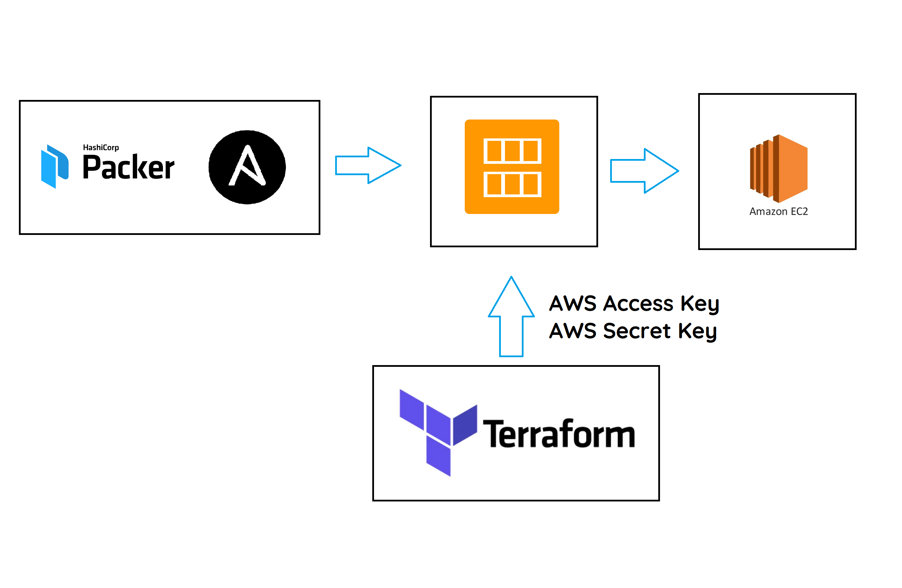

# AWS Automation

## Terraform

- Terraform is an IAC orchestration tool
- It allows a user to create IAC for deployment on any cloud
- Terraform means "tranform the earth"
- It is a Hashicorp product



Terraform can automatically deploy AMI's (Amazon Machine Images) onto an instance, with the use of Packer it can quickly and efficiently create AMIs (with Packer) that is then deployed to any amount of machines (with Terraform). This workflow can be easily scalable and customisable.

### Why Terraform

- It helps you scale up and down as per the user demand

### Best use cases

- It makes us cloud independant
- Works with AWS, Azure, GCP

### Other IAC Tools

- Orchestration with Terraform
- From an AMI to EC2 with customised configuration

### Language

- HCL
- Similar to JSON in terms of syntax
- [Example](terraform_lesson/main.tf)

### Syntax

Initialise a folder

```bash
terraform init
```

Validate .tf files

```bash
terraform validate
```

Display the exact actions terraform will take

```bash
terraform plan
```

Execute the .tf files

```bash
terraform apply
```

Display output (if specified)

```bash
terraform output
```

## Packer

Packer is an automated machine image building software. Packer is also created by Hashicorp just like Terraform. It allows a user to automatically create AWS (or other cloud providers) machine images that can then be deployed with the use of terraform. Packer will create a blank image and then provision that instance with the specified packages, after which it will create a machine image that is ready to use for Terraform.

### How to use packer

Packer uses a JSON language for defining its variables and functionality. An example of a packer file can be seen [here](packer_lesson/app.json).

### Syntax

Validating a packer file

```bash
packer validate file.json
```

Running a packer file

```bash
packer build file.json
```

Adding variables at runtime

```bash
packer build -var 'key=VALUE' file.json
```
